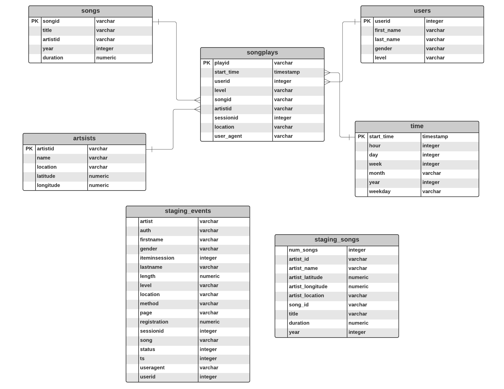

# Sparkify Data Pipelines with Airflow
### Introduction
A music streaming startup, Sparkify, wants to automate and monitor their data warehouse ETL pipelines with Apache Airflow. They want high grade data pipelines that are dynamic and built from reusable tasks, can be monitored, and allow easy backfills. Additionally, they want to run tests against their datasets after the ETL steps have been executed to catch any discrepancies in the datasets to ensure data quality. Their data (JSON) resides in S3 and needs to be processed in a data warehouse in Amazon Redshift.
### Project Objective
Build a data pipeline by creating custom operators to perform tasks such as creating tables in postgres, staging the data, filling the data tables, and running data quality checks on the data as a final step. 
## Contents
1. airflow/dags/sparkify_dag.py: Python file with DAG to run ETL processing using Airflow
2. airflow/dags/create_table_stmts.py: Python file with sql queries to create the tables in postgres
3. airflow/plugins/helpers/sql_queries.py: Python file with sql queries to load the tables
4. airflow/plugins/operators/create_tables.py: Drop and create table operator
5. airflow/plugins/operators/data_quality.py: Data quality check operator
6. airflow/plugins/operators/load_dimension.py: Dimension table load operator
7. airflow/plugins/operators/load_fact.py: Fact table load operator
8. airflow/plugins/operators/stage_redshift.py: Staging tables operator
## Schema

## Prerequisites
1. Airflow 1.10.2
2. An active Redshift Cluster in us-west-2 with 4 instances
3. An `IAM user` with `AmazonRedshiftFullAccess`, `AdministratorAccess`, and `AmazonS3ReadOnlyAccess`
## How to Run
1. Start airflow in the workspace by running `/opt/airflow/start.sh`
2. In the Airflow UI
* Create `aws credentials` and `redshift` connections in the Airflow UI using your `IAM user` credentials and Redshift cluster information
* Turn on the dag (left-hand side)
* Trigger the dag (right-hand side) or wait for the hourly scheduled run
